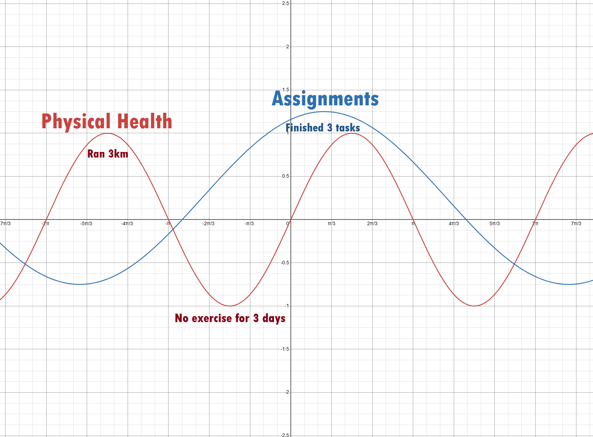
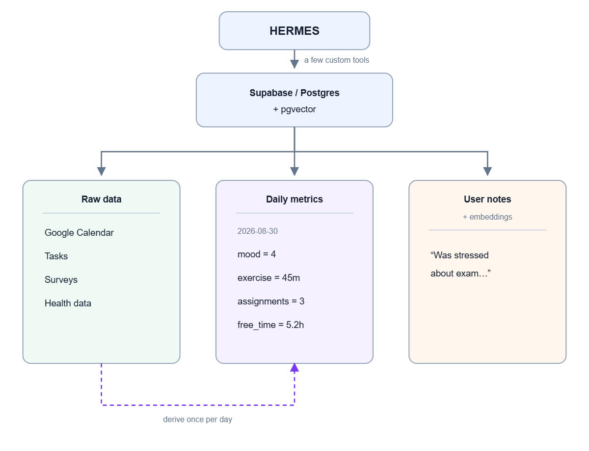
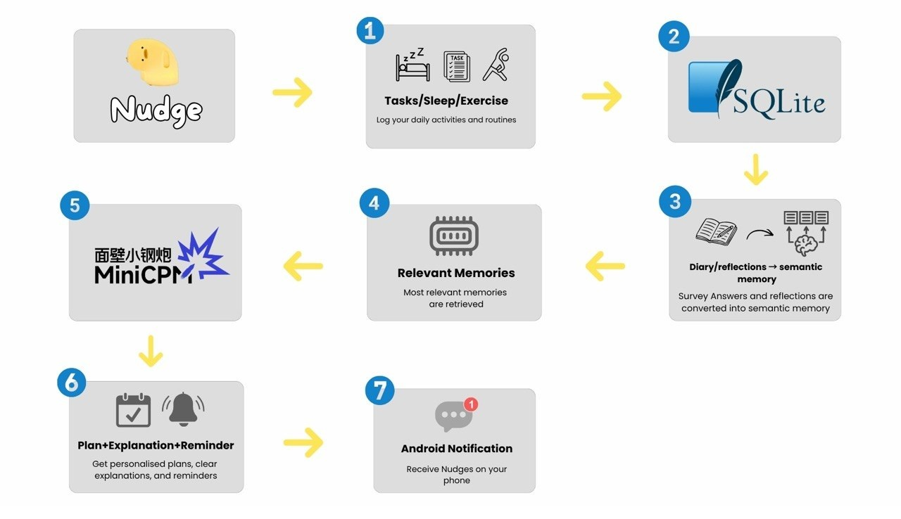

# Nudge by Macaroon

**Team:** Leonard Su, Dewmi Anusha, Lim Lee Khang, Tan Bo Yu  
**Problem Statement:** Stress & Workload Manager  
**Video Presentation:** Pending  
**Prototype Slides:** Pending  
**Figma Ideation Board:** [Mindmap, Problem Tree, and Final Architecture](https://www.figma.com/board/bJGluDSU0T1qYWG7pH7Cy3/AI-Task-Manager-%E2%80%94-Ideation-Journey?node-id=0-1&p=f&t=Rpq8sJP5aY1IzzyN-0)

## 1. Project Overview

### The Problem

A student's calendar can look organised while their life feels messy. Typical task managers record classes, work blocks, and assignment deadlines. However, these records leave out poor sleep, unfinished work, postponed exercise, and difficult weeks, which greatly affects how much a student can manage.

Students need a way to connect their academic workload with how they are feeling. Knowing that three assignments are due next week is useful. Knowing how much work remains, when it can fit, and what helped during a similar week gives them a clearer next step.

Existing tools address parts of this problem. [ClickUp](https://help.clickup.com/hc/en-us/articles/15428419095831-ClickUp-AI-models-privacy-and-security-FAQ) provides AI assistance within a work-management platform, while [Reclaim](https://help.reclaim.ai/en/articles/13178785-reclaim-ai-disclosure) automates calendar scheduling. Our focus is a student planner that brings assignments, personal reflections, and well-being check-ins together, with AI processing and personal memory on the student's own phone. As a bonus, everything will be completely free of charge without the need of API keys or subscriptions. 

### Our Solution

Nudge is an Android personal planning app that connects academic workload with sleep, exercise, and well-being. It uses an on-device AI assistant to suggest priorities, explain workload, and recall useful experiences from the student's diary. The core app works offline after the models are downloaded, with a built-in calendar and an optional Google Calendar connection. Students can start with a task name, add details later, and choose when they want to check in. 

Nudge is designed to be a personal companion for students, helping them balance academic demands with their available time, energy, and well-being. By connecting planning with reflection, it supports realistic next steps when students feel busy or overwhelmed. This makes Nudge more than a task manager: it helps students understand what they can manage and adjust their plans as their circumstances change.

### Core features

- **Local AI architecture.** A compact language model handles summaries and planning with local tools and storage. Students can use the core app without an AI subscription, API key, or uploading their diary to an inference service.
- **A planner with personal context.** The assistant uses preferences, assignment progress, and past reflections to suggest work blocks and breaks that fit the student.
- **A clear workload overview.** Application code calculates commitment utilisation and deadline pressure. The assistant explains the results alongside sleep, exercise, and well-being observations.
- **Quick assignment capture.** Save an assignment with just its name. Missing deadlines and effort estimates go into a pending-information list for later review.
- **Flexible check-ins and weekly reviews.** Short check-ins run on Tuesday, Friday, and Sunday by default. Sunday brings together progress, difficulties, and next week's priorities. Students can change the schedule or log an update at any time.
- **A private, searchable diary.** Ask questions such as "What helped the last time I felt overwhelmed by group work?" and retrieve relevant entries, including their original text and dates.
- **An integrated calendar and local reminders.** Assignments, errands, commitments, and work blocks live in one place. Accepted reminders use Android notifications, so they can arrive while the app is closed.
- **Portable memory with JSON backup and restore.** Export all personal memory and app records as a JSON file for transfer or back them up directly to the cloud. Import the backup on another device to continue with the same history and preferences.

Consider a student approaching a group-project deadline. They have eight hours of work left and only six available work hours before submission. Nudge shows the time shortfall and retrieves an earlier reflection about how splitting a project into smaller sections helped them get started. It suggests the next section to work on, a suitable work block, and a break. The student reviews the plan and saves the reminder.

## 2. Ideation & Process

### 2.1 Ideas We Considered

We started with a task manager that understands the person using it. Persistent-memory agents such as Hermes and OpenClaw inspired us to connect conversation, stored preferences, and tools. We narrowed that idea to student planning and placed the assistant and its memory on the same device.

#### Chosen ideas

| Idea | Why we chose it |
| :--- | :--- |
| On-device AI with MiniCPM5-1B and llama.cpp | Keeps personal context on the phone and removes per-request model fees. |
| Structured records and vector memory | SQL supports exact queries about tasks and time. Vector search finds diary passages by meaning. |
| Built-in task management and calendar | Gives the assistant records it can use to suggest and save practical plans. |
| A compact, editable user profile | Carries useful preferences into future conversations and lets students correct what the assistant remembers. |
| Skippable task details with follow-ups | Lets students capture work immediately and complete missing information later. |
| Flexible check-ins and a Sunday review | Connects planning with progress and reflection while keeping the routine short. |
| WHO-5 every two weeks | Gives students a regular view of their well-being alongside shorter check-ins about everyday progress. |

#### Dropped ideas

| Idea | Why we dropped it |
| :--- | :--- |
| A full Hermes/OpenClaw-style agent | Although powerful, its broad action space exceeded our needs. Nudge uses a small set of tools for records, retrieval, and planning. |
| A larger model on a team workstation | Added a shared hardware bottleneck, server upkeep, and remote handling of personal information. |
| A website with hosted AI and Telegram/WhatsApp integration | Added accounts, messaging services, and API costs to a product intended for private everyday use. |
| Hosted Postgres/Supabase with vector search | We kept the relational-plus-vector design and moved storage onto the phone to remove the database-service dependency. |
| LFM2.5-1.2B (Thinking) | We selected MiniCPM5-1B for its smaller parameter count and stronger tool-use results in OpenBMB's comparison. |

#### Deferred integrations

| Idea | Place in the product |
| :--- | :--- |
| Google Calendar | An optional source of commitments after the built-in calendar works end to end. |
| Health-service integration | A later way to import sleep and activity. The first build uses self-reports. |
| Follow-up questions after classes | A later extension for capturing details such as a newly announced deadline. The first build uses the pending-information list and scheduled reviews. |

Our team discussions also refined the input flow. We changed daily reflection reminders to a configurable three-day schedule, with optional updates between check-ins. We replaced difficulty labels such as "Easy" and "Hard" with working-time ranges, so estimates connect directly to available hours. We also replaced warnings based only on unanswered reminders with a clear "Details needed" state, snoozing, and follow-ups tied to known deadlines.

The main architecture decision was to separate **reasoning from memory and calculation**. SQLite stores the history, retrieval selects relevant passages, and application code calculates time and scores. The model uses those results to explain the situation and suggest an action.

### 2.2 Ideation Boards

This concept sketch shows our starting concern: academic progress can take attention away from exercise and recovery. It led us to bring workload and personal check-ins into the same planner.

The early design separated raw records, calculated metrics, and personal notes. We kept those roles and moved the hosted Hermes/Supabase design shown here onto Android.

The final architecture of the system shows a simple concept where aspects like tasks, sleep, and exercise and derived into metrics and logged into SQLite. Daily written reflections are stored in a vector database. These records will be retrieved by code and processed by MiniCPM5-1B, which will finally be sent to the user via a plan + explanation + reminder as an Android notification. 

#### **Final Mindmap, Problem Tree, and Chosen Concept**
> This board contains the collection of idea brainstorming, rejections and explanations, as well as the final architecture after mentor consultation.  
> [Open Figma Board →](https://www.figma.com/board/bJGluDSU0T1qYWG7pH7Cy3/AI-Task-Manager-%E2%80%94-Ideation-Journey?node-id=0-1&p=f&t=Rpq8sJP5aY1IzzyN-0)

### 2.3 Mentor Consultation

| Date | Mentor | Feedback Received | What Was Changed |
| :--- | :----- | :---------------- | :--------------- |
| 10 Sep 2026 | Lim Zi Yang | Add local backup files first, followed by online backup, with automatic cloud backup similar to WhatsApp as a reference. | The prototype design now includes a complete JSON export of personal memory and app records, saved as a transferable file or backed up directly to the cloud. This also inspired a JSON import system so students can restore their history and preferences on another device when they buy a new phone. Local file backup and restore come first, followed by optional cloud backup. |
| 10 Sep 2026 | Lim Zi Yang | Build a basic, barebones app for the team's own testing of tokens per second (TPS) and architecture. | We will take this into consideration during prototype implementation as a way to measure generation speed and test the architecture before expanding the app. |
| 10 Sep 2026 | Lim Zi Yang | Install and test the LLM before adding other app features, because it is the foundation of the assistant. | We will take this into consideration during prototype implementation by testing MiniCPM5-1B in isolation before connecting retrieval, planning, and the other features. |
| 10 Sep 2026 | Lim Zi Yang | Make sure MiniCPM5 supports tool calling. | We had already considered tool calling during planning and selected MiniCPM5-1B as our best-in-class choice in the roughly 1B-parameter open-source weight class for its balance of tool calling and general intelligence, based on OpenBMB's published comparison. Its model card explicitly documents XML-style tool calls. [Model capabilities and comparison](https://huggingface.co/openbmb/MiniCPM5-1B) |

The main design correction from this session is **JSON backup and import for portable memory**. The barebones test app and LLM-first testing sequence are considerations for prototype implementation. The model selection was already part of our planning, as explained in [Why MiniCPM5-1B](#why-minicpm5-1b).

## 3. Design & Prototype

**UI Prototype:** [Eleven screen mockups](nudge-prototype/) showing the proposed mobile interface. These images demonstrate the layout and example user journey.

### Screens we designed

The design uses a yellow duck mascot, rounded cards, and a shared bottom navigation bar across the main screens. Three dashboard views show progress, a to-do list, and metrics, with a **Today's Plan** link below each view.

| Screen | What the mockup shows |
| :--- | :--- |
| [1. Sign Up](nudge-prototype/1.png) | A welcome screen with a language selector, name, email, and password fields, a Next button, and a Sign in link, along with an option to continue offline. |
| [2. Onboarding Survey](nudge-prototype/2.png) | A survey for new users to enter their initial preferences so the app can be personalised to their lifestyle. |
| [3. Progress](nudge-prototype/3.png) | A dashboard card with a pie chart displaying placeholders for the user's well-being metrics, followed by a link to Today's Plan. |
| [4. To-do List](nudge-prototype/4.png) | Assignments and meetings with checked and unchecked states and a menu beside each item. |
| [5. Metrics](nudge-prototype/5.png) | Week, Month, and All Time controls, a date range, a short weekly summary, an overview line chart, and a category breakdown. |
| [6. Today's Plan](nudge-prototype/6.png) | A timeline containing meetings, study, a meal break, exercise, and wind-down time. Below it are a short planning nudge and an Evening Reflection link. |
| [7. Reflection](nudge-prototype/7.png) | Five mood faces, a yes/no question about completing today's plan, a free-text reflection field, and a Submit button. |
| [8. Add Plans](nudge-prototype/8.png) | Fields for a title, estimated workload, deadline, and details, followed by an Add button. Workload choices are Easy (less than one week), Medium (less than one month), and Hard (more than one month). |
| [9. Add Details Reminder](nudge-prototype/9.png) | A reminder sent by Nudge for users who only entered their assignment name without an estimated workload or deadline. |
| [10. Ask Nudge](nudge-prototype/10.png) | An example conversation about feeling overwhelmed, choosing a first task, and rearranging the evening, with suggested prompts and a message input. |
| [11. Assignment Action Plan](nudge-prototype/11.png) | An urgent warning page for an assignment nearing its due date. This page explains to the user why this time crunch happened and the next best steps. |

### The student journey

The mockups illustrate how a student can move between recording work, reviewing the day, asking for help, and reflecting on progress. **Add plans** captures an assignment or activity. The **To-do List** presents work as a checklist, while **Today's Plan** places academic and personal activities into a daily timeline.

**Ask Nudge** shows the intended tone of the assistant. When the student feels overwhelmed, it suggests a small starting action: review meeting notes for ten minutes before beginning an assignment draft. The conversation also illustrates using a remembered preference for a restful evening when adjusting the plan.

The reflection screen closes the loop by asking how the day felt, whether the plan was completed, and what else the student wants to record. The Progress and Metrics views illustrate how the app could bring this history back into an overview.

## 4. What Makes It Different

**Uses local AI on mobile.** As opposed to using cloud-based AI models for inference, our product exploits the recent advancement in smaller AI models that runs locally on mobile.

**Personal history helps shape the next plan.** A reflection about group work, a useful break, or a preferred study time becomes context for later suggestions. The student can open the original entry and see why the assistant brought it up.

**The app works with incomplete information.** A student can capture a task before knowing its deadline or effort. Nudge keeps the task visible, explains which details are missing, and returns to them during a review. This makes it easier to use when the student is already busy.

**Personalisation grows through memory.** Nudge uses retrieval-augmented generation (RAG) and an editable profile to bring relevant history into each conversation. The model's weights stay the same; its context grows as the student records more experiences.

**Planning and private reflection share one local system.** Inference, SQL storage, semantic retrieval, and reminders run on the phone. The student can use personal context for planning while keeping diary processing local.

**Daily use has no per-request AI fee.** Our aim is a free core app. Each phone runs its own assistant and stores its own records, so adding users does not require a matching increase in hosted inference or database capacity.

## 5. Technical Architecture & Feasibility

### Tech stack

| Layer | Technology | Why it fits Nudge |
| :--- | :--- | :--- |
| Android app | APK with native integration for storage, inference, and notifications; UI toolkit selection during implementation | Connects the interface to local device capabilities. |
| Local reasoning | MiniCPM5-1B Q4_K_M through llama.cpp | Runs a compact assistant with tool-calling support on the phone. |
| Agent execution | Custom orchestrator with a bounded tool registry | Gives the model typed operations for reading records, retrieving memories, and proposing plans. |
| Structured storage | SQLite with derived metric views | Stores source records and calculates exact dates, counts, and time totals. |
| Semantic memory | EmbeddingGemma-300m QAT Q4_0 GGUF through llama.cpp, with sqlite-vec | Supports multilingual diary retrieval using the same inference library as the assistant. |
| Scheduling | Android AlarmManager and local notifications | Delivers saved reminders independently of an active conversation. |
| Optional integration | Google Calendar | Imports existing commitments alongside the built-in calendar. |
| Distribution | Installable APK and downloadable models | Keeps the core app independent of a hosted backend or inference API. |

### How the assistant works

For a request such as "Help me make tomorrow less packed," Nudge follows this flow:

1. Read tomorrow's tasks, commitments, remaining effort, and time budget.
2. Calculate available capacity and retrieve relevant preferences and reflections.
3. Give those records to the local model to produce a plan and explanation.
4. Check the proposed blocks against fixed commitments, deadlines, and available time.
5. Show the suggestion and its supporting records to the student.
6. Save the accepted changes and schedule the reminders.

Application code handles calculations, input validation, and record updates. The model chooses from a small set of tools and explains the results. This gives Nudge a clear path from a conversation to an action the student can review.

### Personal memory and profile updates

The profile is inspired by the compact `SOUL.md`-style files used to carry persistent context into agent conversations. Nudge stores the authoritative preferences in SQLite and generates a short profile summary for the model. This keeps the profile consistent with the rest of the app's records.

When a student submits a reflection, Nudge:

1. Saves the original text and date.
2. Extracts useful observations and possible preferences.
3. Compares them with the saved profile.
4. Adds clear new preferences and applies explicit corrections.
5. Asks a short follow-up when a possible preference conflicts with the profile and the student's intent is unclear.
6. Refreshes the profile summary and links each saved preference to its source.

For example, "I studied late tonight" stays an observation about that night. "I now prefer studying after dinner" updates a study preference. Students can inspect, edit, or remove both their reflections and saved preferences.

### Records and metric calculations

SQLite holds the source data. The main record groups are:

| Records | Contents |
| :--- | :--- |
| Assignments | Name, status, start date, deadline, initial estimate, and current remaining effort, including estimate ranges. |
| Commitments and work blocks | Fixed events, planned study time, breaks, and links to assignments. |
| Progress updates | Dated changes to task status and remaining effort. |
| Check-ins and reflections | Original text, individual ratings, reported durations or ranges, and the dates they describe. |
| WHO-5 assessments | Five item responses, assessment date, two-week reporting period, and score. |
| Preferences and profile | Time budgets, targets, reminder settings, saved preferences, and links to their sources. |
| Pending information and reminders | The assignment and field needing an answer, reminder time, snooze state, and resolution status. |
| Derived metrics | Daily commitment utilisation, deadline pressure, sleep differences, and weekly exercise totals calculated from source records. |
| Embedding chunks | Search vectors linked to the original entry, passage, and date. |

Nudge displays five separate indicators:

| Indicator | Calculation | What it tells the student |
| :--- | :--- | :--- |
| Commitment utilisation | Non-overlapping committed minutes / daily commitment budget in minutes × 100 | How much of the day's chosen time budget is occupied. Values above 100% show that commitments exceed the budget. |
| Deadline pressure | Estimated remaining work hours / available work hours before the deadline | Whether the remaining work fits. A ratio above 1 shows a time shortfall. |
| Exercise-goal completion | Reported completed exercise minutes this week / weekly exercise target in minutes × 100 | Progress towards the student's weekly exercise goal. |
| Sleep relative to target | Reported sleep duration − personal sleep target | How far a recorded night's sleep is above or below the chosen target. |
| WHO-5 well-being | 4 × sum of five responses, each scored 0–5 | A score from 0 to 100, with higher scores indicating better reported well-being over the past two weeks. |

For example, two hours of classes plus 135 minutes of planned work occupy 255 minutes. Against a six-hour commitment budget, that is about **71% utilisation**. Overlapping blocks count once and appear as scheduling conflicts. Deadline pressure uses the student's available work time within their daily budget and allocates shared time across competing assignments.

The app keeps planned exercise separate from reported completion. Ranges produce range-based results, while missing inputs display the detail needed. Periods without reports display "No data". A zero target displays "No goal set"; remaining work with zero available time displays "No available work time". Completed and cancelled assignments leave the deadline-pressure calculation. An incomplete WHO-5 assessment stays incomplete until all five answers are supplied.

Sleep targets use age-based guidance during setup and remain editable. WHO-5 follows the original five-item scoring method. Sources and worked examples are in the [metric evidence](docs/TECHNICAL_EVIDENCE.md#metric-definitions-and-sources).

### Why MiniCPM5-1B

MiniCPM5-1B has approximately **1.08 billion parameters**, XML-style tool calls, and thinking and non-thinking modes. Its **688 MB Q4_K_M** file is about **68% smaller** than the **2.17 GB F16** file. We selected it to run a focused planning assistant within a phone-sized storage budget. [Model capabilities](https://huggingface.co/openbmb/MiniCPM5-1B), [model files](https://huggingface.co/openbmb/MiniCPM5-1B-GGUF/tree/main)

OpenBMB reports the following results for the thinking variants:

| Benchmark | MiniCPM5-1B | Qwen3.5-0.8B | LFM2.5-1.2B |
| :--- | ---: | ---: | ---: |
| τ²-Bench Telecom-AA | **79.53** | 47.70 | 19.60 |
| BFCLv4 | 25.15 | **25.53** | 10.60 |
| IFEval | 80.41 | 59.89 | **84.84** |

The Telecom-AA and BFCLv4 results support our choice for conversation and tool use, while IFEval covers instruction following. Nudge gives the model a focused tool set and uses non-thinking mode for routine summaries. [Publisher benchmark table](https://raw.githubusercontent.com/OpenBMB/MiniCPM/main/assets/minicpm5/public_leaderboard_en.png)

OpenBMB provides an Android demonstration with MiniCPM5-1B support, and llama.cpp provides an Android integration guide. We will build the tool-format adapter on this runtime and measure response quality, speed, and memory use on our test phones. [Android demo](https://github.com/OpenBMB/MiniCPM-V-Apps), [llama.cpp Android guide](https://github.com/ggml-org/llama.cpp/blob/master/docs/android.md)

### Local diary retrieval

**EmbeddingGemma-300m** supports more than 100 languages, which suits a student diary containing different languages. We chose its **QAT Q4_0 GGUF** version to share llama.cpp with the assistant. This replaces the earlier English-focused MiniLM and separate ONNX Runtime Mobile route. [Embedding model](https://huggingface.co/google/embeddinggemma-300m), [GGUF integration](https://huggingface.co/ggml-org/embeddinggemma-300M-qat-q4_0-GGUF)

Google's published MTEB results show that Q4_0 retains most of the full-precision model's retrieval performance: **60.62 versus 61.15** on Multilingual v2 and **69.31 versus 69.67** on English v2, differences of **0.53 and 0.36 points**. [Published evaluation](https://huggingface.co/google/embeddinggemma-300m#benchmark-results)

The model supports **2,048 input tokens**. Nudge uses **256-token inputs**, including the retrieval prefix, and splits longer reflections into dated passages. It embeds new or changed passages once and reuses their vectors. Search first applies relevant date filters, ranks passages by meaning, and supplies a few original passages to the assistant with their source IDs.

Our baseline uses **768-dimensional float32 vectors**. For **3,650 chunks**, the raw vectors occupy about **10.69 MiB**, with source text and database storage added separately. The model also supports smaller vectors; **256 dimensions** would reduce the same vector payload to **3.56 MiB**. Shorter input passages limit encoding work, while smaller output vectors reduce storage and search work. We will compare retrieval quality before switching from the full output.

The integration uses the model's query/document prefixes, tokenisation, pooling, vector normalisation, and supported activation precision. sqlite-vec runs within a compatible native SQLite package. Editing or deleting a reflection updates its vectors; changing the embedding model rebuilds the search index. [sqlite-vec mobile support](https://alexgarcia.xyz/sqlite-vec/android-ios.html), [retrieval details and calculations](docs/TECHNICAL_EVIDENCE.md#local-semantic-memory)

### Device footprint and testing

The two model files total approximately **966 MB**: **688 MB** for MiniCPM5-1B and **278 MB** for EmbeddingGemma. The embedding choice adds about **255 MB** over the earlier MiniLM file budget. Installation also needs room for the APK, supporting assets, downloads, and personal records.

For MiniCPM5-1B, the calculated FP16 attention-cache payload is **48 MiB at 2,048 tokens** or **96 MiB at 4,096 tokens**. Total runtime memory also includes model weights, runtime buffers, the embedding session, and the interface. Google reports a runtime footprint below 200 MB for its quantised EmbeddingGemma deployments. For our selected GGUF, the download is 278 MB; phone tests will measure loaded memory. [Model and memory evidence](docs/TECHNICAL_EVIDENCE.md#model-files-and-runtime-memory)

OpenBMB recommends **at least 4 GB of RAM** for its MiniCPM5-1B demonstration. Our test set covers a primary demo device, midrange phones, and older hardware:

| Available phone | Test role |
| :--- | :--- |
| Xiaomi 13T | Primary development and demo device; MediaTek platform. |
| Nothing Phone (1) | Midrange Qualcomm comparison. |
| Samsung Galaxy S23 Ultra | Flagship performance comparison. |
| Sony Xperia 1 II | Older flagship and Android-version coverage. |
| Samsung Galaxy A52 | Lower-performance comparison. |

We will record each unit's model, RAM, and Android version, then measure cold loading, time to first token, full-response time, peak RAM, indexing speed, and repeated use. Tests will compare keeping both models loaded with unloading one before running the other. Retrieval tests will check whether the assistant finds the right student entry, and tool tests will check valid actions and schedule conflicts. [Hardware specifications and test details](docs/TECHNICAL_EVIDENCE.md#device-test-scope)

### Local scheduling and data ownership

Android schedules saved reminders, including task nudges, pending-information follow-ups, and check-ins. Reminder records survive app closure and are restored after reboot. The implementation handles notification permissions, quiet hours, and device power-management settings. [Android scheduling documentation](https://developer.android.com/develop/background-work/services/alarms)

Personal records and embeddings use app-private storage. Diary retrieval and inference run locally. Deletion covers source records, saved profile information, and related vectors. Students control JSON exports and optional cloud backups through storage settings. Google Calendar is a separate opt-in connection for calendar data.

### JSON backup and import

The mentorship session highlighted the need to carry local memory across devices. We will design the prototype so that **all personal memory and app records can be exported as a JSON backup**, including tasks, commitments, progress, check-ins, reflections, WHO-5 assessments, saved preferences, and reminder settings. The backup will preserve record IDs, dates, and source links so the restored profile and history remain connected. Derived metrics and search vectors can be rebuilt from the restored source records.

Local file export and import come first. Students will be able to save the JSON file, transfer it elsewhere, and import it into Nudge on another device. For example, a student buying a new phone can import their backup to restore their history, preferences, and planning records. The import will check the backup format and version before restoring records to SQLite and rebuilding local search and reminders.

The same JSON backup will also support direct cloud backup, followed by optional automatic backups. The mentor suggested a WhatsApp-style Google cloud backup experience as a reference; the provider and backup schedule will be decided during prototype implementation. Cloud backup will be opt-in, and local file backup and restore will work without a cloud account.

### Build plan & scope

The first build centres on one complete student journey on the **Xiaomi 13T**: capture an assignment, complete its details, inspect workload, receive a memory-informed suggestion, save a reminder, and review progress.

1. **Run the local models.** Integrate MiniCPM5-1B and EmbeddingGemma with llama.cpp, including structured tool calls and diary retrieval.
2. **Build the records and calculations.** Add setup, tasks, progress updates, manual commitments, pending details, and the five indicators in SQLite.
3. **Connect memory to planning.** Add the editable profile, source-linked retrieval, schedule checks, and acceptance of suggested changes.
4. **Complete the routine.** Add local reminders, flexible check-ins, the Sunday review, and WHO-5 every two weeks.
5. **Add backup and verify the full flow.** Build local JSON export and import, then optional cloud backup. Verify restoration on another device, saved data after reopening, offline use after model installation, source-backed answers, and reminder delivery with the app closed and after reboot.

The remaining phones extend performance and compatibility testing after the primary flow works. Google Calendar, health imports, and after-class questions follow the core build. The prototype and video will show the same student journey, so the submission explains both the problem and how Nudge helps the student take the next step.
